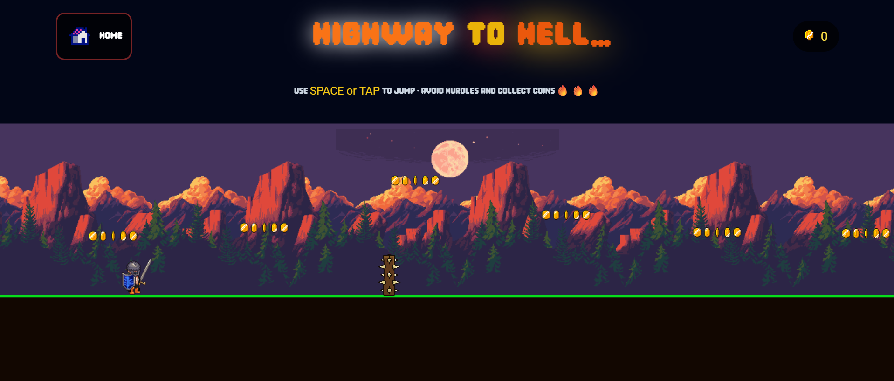

A React + Pixi.js arcade-style runner built with retro pixel art

Highway to Hell is a fast-paced 1-player endless runner built using Pixi.js for rendering and React for UI + routing.
The objective is simple yet addictive: jump, dodge the deadly hurdles, collect coins, survive as long as possible.
This game was my first ever project using Pixi.js, created to explore 2D rendering, sprite animation, game loops, collision detection, and physics inside a React environment.
🔥🔥Its features:
Retro pixel-art world & characters
Smooth parallax background
Tap / Spacebar jump controls
Real-time score counter
The project is built using:
{
  "axios": "^1.7.2",
  "pixi.js": "^8.14.3",
  "react": "^18.2.0",
  "react-dom": "^18.2.0",
  "react-icons": "^4.12.0",
  "react-router-dom": "^6.22.0"
}
Pixi.js → for high-performance 2D rendering, animated sprites, obstacles, physics & game loop
React → for UI, game screens, routing & overall structure
React Router → multiplayer pages like Home → GameScreen
Axios → optional networking (if needed later for leaderboards, analytics, etc.)
🕹️ Controls
SPACE → Jump
TAP (on mobile) → Jump
🏆 Objective
Avoid spikes and obstacles
Collect coins to increase score
Survive as long as possible on the “Highway to Hell”
👤 Character
The player uses a knight sprite generated from the
Universal LPC Spritesheet Generator

Background & Environment
Sprites sourced from itch.io: https://ansimuz.itch.io/mountain-dusk-parallax-background
Character Sprite: https://liberatedpixelcup.github.io/Universal-LPC-Spritesheet-Character-Generator

📦 Installation & Running Locally
Clone the project:
git clone https://github.com/Aditya30december2003/game_highwayTohell.git
cd highway-to-hell
Install dependencies:
npm install
Run development server:
npm start
Build for production:
npm run build
